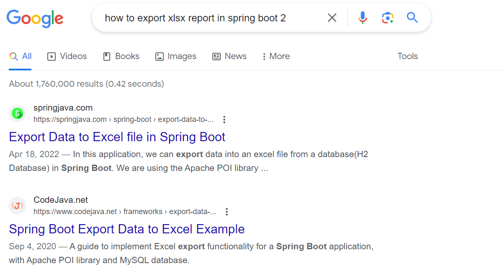
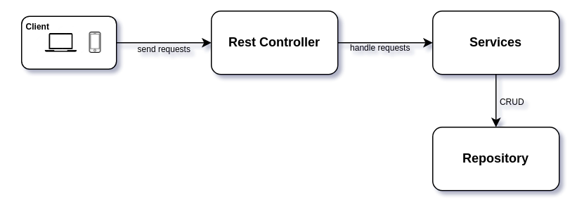

# Spring Boot Template Project

Thanks to my brothers **SonPM**, **DatDD**, **LinhPH**.

## Overview
Whenever I need to implement a new feature, I typically start by researching available solutions on Google. Then I will experiment with one or more solutions to select the best one.
However, after several months, I might _forget how to implement that feature_. Consequently, I end up having to _revisit internet resources, conduct research once again, and reattempt the implementation_.

The above situation is very common, not just for me but also among my friends and colleagues. We waste a lot of time recalling and researching solutions - things could be synthesized in a template project for the next implementation.

So I have developed this project which includes implementations designed to assist both myself and other Spring Boot developers in seamlessly diving into coding. Each commit within the project represents the implementation of a specific technique.

_The project uses Java 17 and Spring Boot 3.1.5_.

**If you find this project useful, please give it a star ⭐️!**

## Architecture
I designed the project with 4 main components:

    .
    ├── application               # Controllers, passing user requests into services respectively
    ├── core                      # Domain logic, designed into services
    ├── infrastructure            # Config, repository, third parties,...
    └── shared                    # Constants, DTO, utils,...

And we have a main flow as shown below:

## Features

#### Authen/Authorization
- [x] Fixed Token Authentication
- [x] JWT Authentication
- [ ] Session based Authentication
- [x] Authorization

#### Web Basics
- [x] Basic REST API
- [x] Spring JDBC, Spring JPA
- [x] Pagination
- [x] MDC logging
- [x] Exception Handling
- [x] Jackson & JSR310
- [x] REST client with OpenFeign
- [ ] SOAP client with JAXB
- [x] Background Job
- [x] Retry
- [x] ActiveMQ and Spring JMS Integration
- [x] Export XLSX/CSV reports
- [x] CORS configuration
- [x] Swagger

#### Advanced Techniques
- [x] Caching with Redis
- [x] Caching Local with Caffeine
- [x] Multiple Cache Manager
- [x] MultiThread, Async
- [x] Event Handling
- [x] Race Condition Handling (Redis/MongoDB Lock)
- [ ] Distributed Transactions
- [x] Kafka Producer/Consumer (Json, Avro)
- [x] Search Backend with Elasticsearch
- [x] Generate and send emails
- [x] Rate Limiter with Bucket4j
- [x] Circuit Breaker, Rate Limiter with Resilience4j
- [x] Distributed Tracing with Micrometer and Zipkin

#### Datasource
- [x] Multiple DataSource Configuration
- [x] Read/Write Splitting

#### Unit Test
- [x] Unit Test common cases (with Junit 4, Mockito, PowerMock)
- [x] Integrate Jacoco for Code Coverage

#### Monitoring
- [x] Monitoring with Actuator & Prometheus
- [x] Sentry Integration

## How to use
Firstly, clone it to your local and open by your IDE (IntelliJ, Eclipse).

Each commit will be a feature except **update README.md** commits. For example, you can search on **IntelliJ** (**Git** tab) by feature keywords:

Then you can apply the code of the corresponding commit for your feature. 

## Setup

To run this project (optional for new guys, **minimum 16GB RAM** if you want to run local **Elasticsearch**)

- Download and install [IntelliJ IDEA](https://www.jetbrains.com/idea/download/) (Recommends)
- Install [Docker and Docker Compose](https://linuxhint.com/install-docker-compose-ubuntu-22-04/) if you don't have your own database and message brokers
- Run `git clone https://github.com/hieubz/spring-boot-based-project.git`
- [Configure](https://www.jetbrains.com/help/idea/sdk.html#change-project-sdk) **JDK 11/17** for your project on **IntelliJ IDEA**
- Run `docker-compose up -d` to start **MySQL**, **MongoDB**, **Redis**, **Kafka**, **ActiveMQ** and **Elasticsearch** (or update your database configs in **application.properties**)
  
    _Notes: **Elasticsearch** container requires much RAM on local_

- Run **_resources/schema/mysql-schema.ddl_** to initialize your MySQL database.
- Run commands in **_resources/schema/mongo-schema.ddl_** to initialize your MongoDB database.
- Run your **DemoApplication** and check Swagger UI: http://localhost:8080/swagger-ui/index.html#/

## Tools

#### Redis Commander (for Linux only)

- Install [Redis Commander](https://github.com/joeferner/redis-commander) as your Redis client
- Run `redis-commander --redis-db 10 --redis-password 123` (depends on your db/password config)
- Check your Redis Commander UI: http://127.0.0.1:8081

#### DataGrip

- I recommend using [DataGrip](https://www.jetbrains.com/datagrip/download/) to work with MySQL, MongoDB, Redis
